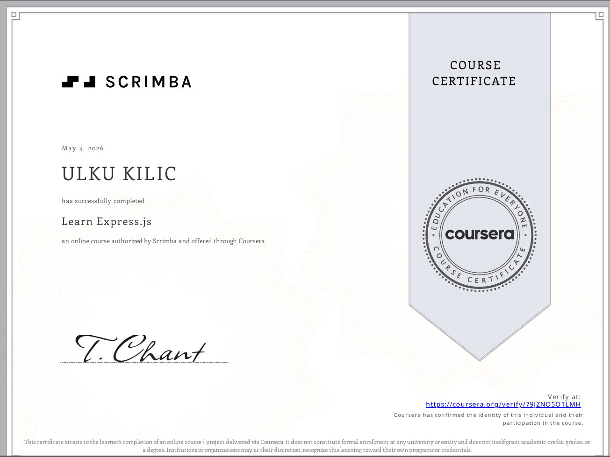

# ✨ Backend Development Certificates

This repository showcases my completed backend development courses in Node.js and Express.js, focusing on RESTful API development, server-side programming, and database integration.

---

## 📜 Certificates

### 1. Building RESTful APIs with Node.js and Express

- **Platform:** Coursera  
- **Provider:** Board Infinity  
- **Completed By:** Ülkü Kılıç  
- **Completion Date:** April 24, 2026  
- **Duration:** ~13 hours  
- **Grade:** 94%  

🔗 Focus: REST API development, Node.js backend architecture, MongoDB integration

---

### 2.  Express.js

- **Platform:** Coursera  
- **Provider:** Scrimba  
- **Completed By:** Ülkü Kılıç  
- **Completion Date:** May 4, 2026  
- **Grade:** 90%  
- **Verification:** https://coursera.org/verify/79JZNO5O1LMH  

🔗 Focus: Express.js fundamentals, routing, middleware, API structure

---

## 🛠️ Skills & Technologies

### Backend Development
- Node.js
- Express.js

### API Development
- RESTful API Design
- CRUD Operations
- Routing & Middleware
- Error Handling

### Database
- MongoDB
- NoSQL Data Modeling
- Basic Database Integration

### Software Engineering
- Modular Backend Architecture
- Secure Coding Practices
- Asynchronous Programming

---

## ✨ Key Learnings

- Building scalable backend applications using Node.js and Express.js  
- Creating and managing RESTful APIs  
- Handling HTTP requests and responses efficiently  
- Using middleware for request processing and validation  
- Connecting backend applications with MongoDB  
- Structuring clean and maintainable server-side code  
- Managing errors and undefined routes properly  
- Understanding backend architecture principles  

