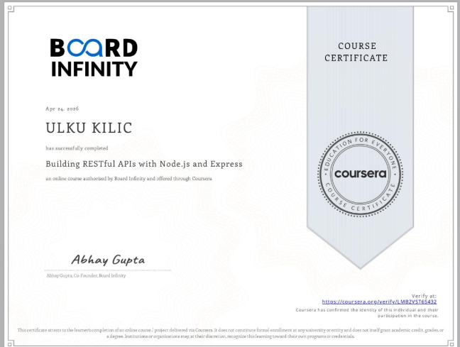

# Building RESTful APIs with Node.js and Express – Certificate

This repository contains my course certificate for successfully completing the **Building RESTful APIs with Node.js and Express** program on Coursera.

---

## 📄 Certificate

---

## 🎓 Course Information
- **Course Name:** Building RESTful APIs with Node.js and Express  
- **Platform:** Coursera  
- **Provider:** Board Infinity  
- **Completed By:** ULKU KILIC  
- **Completion Date:** April 24, 2026  
- **Duration:** ~13 hours  
- **Grade:** 94%  
- **Verification:** Account verified by Coursera  

---

## 📚 What I Learned
- Setting up Node.js and Express applications  
- Creating servers and handling HTTP requests/responses  
- Using middleware for request processing  
- Building RESTful APIs following best practices  
- Connecting Node.js with MongoDB  
- Performing CRUD operations with NoSQL databases  
- Writing asynchronous code and handling errors  
- Structuring scalable and maintainable backend applications  
- Applying basic security practices  
- Introduction to automated testing  

---

## 🛠 Skills Gained
- Node.js  
- Express.js  
- MongoDB  
- REST API Development  
- Middleware  
- Event-Driven Programming  
- Secure Coding  
- Backend Architecture  
- Database Management  

---

## 📌 About the Course
This course focuses on building modern backend applications using **Node.js** and **Express**, with integration of **MongoDB**. It covers both fundamental and advanced concepts required to develop scalable, secure, and production-ready APIs.

---

## 🔗 Certificate Source
Issued by **Board Infinity** and delivered through **Coursera**.